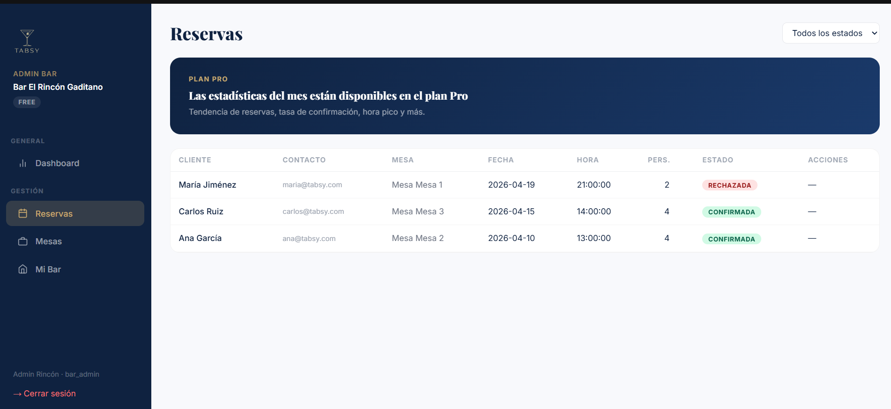
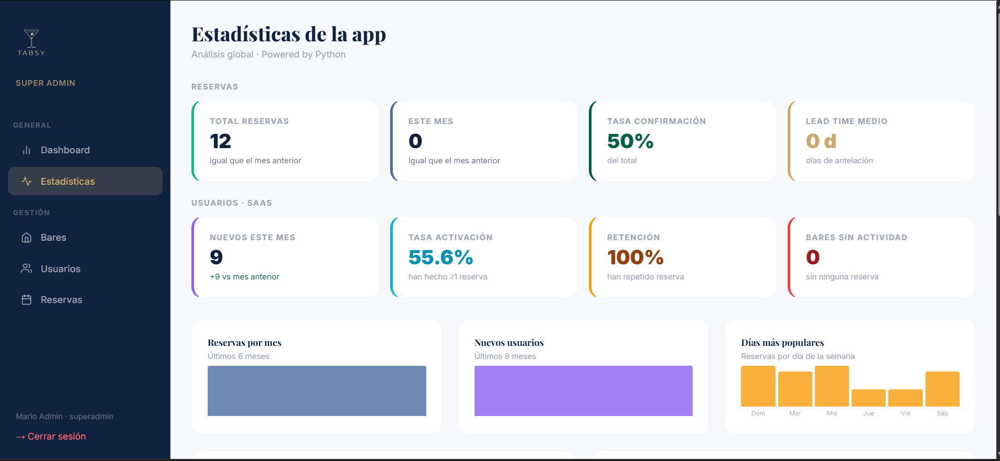

<div align="center">

# TABSY

**Plataforma web de gestión de reservas para hostelería**

*Trabajo de Fin de Grado · Desarrollo de Aplicaciones Web · 2º DAW*
*IES Mar de Cádiz · Curso 2025–2026*


</div>

---

## Tabla de contenidos

- [Sobre el proyecto](#sobre-el-proyecto)
- [Capturas](#capturas)
- [Stack tecnológico](#stack-tecnológico)
- [Arquitectura](#arquitectura)
- [Multi-tenancy y modelo SaaS](#multi-tenancy-y-modelo-saas)
- [Estructura del repositorio](#estructura-del-repositorio)
- [Requisitos previos](#requisitos-previos)
- [Instalación y arranque](#instalación-y-arranque)
- [Variables de entorno](#variables-de-entorno)
- [API REST (Laravel)](#api-rest-laravel)
- [Microservicio de estadísticas (Python)](#microservicio-de-estadísticas-python)
- [Roles y permisos](#roles-y-permisos)
- [Modelo de datos](#modelo-de-datos)
- [Estado del proyecto](#estado-del-proyecto)
- [Trabajo futuro](#trabajo-futuro)
- [Documentación adicional](#documentación-adicional)
- [Autor](#autor)

---

## Sobre el proyecto

**Tabsy** es una plataforma web pensada para digitalizar la gestión de reservas en **bares, pubs y cafeterías** — el segmento de la hostelería que las plataformas existentes (TheFork, Google Reservations) dejan desatendido porque están enfocadas en restaurantes de alta gama.

El proyecto resuelve dos problemas detectados en el mercado local:

- **Para el cliente.** La mayoría de bares solo aceptan reservas por teléfono o en persona, sin información de disponibilidad real.
- **Para el local.** No disponen de una herramienta que centralice las reservas y evite solapamientos o sobreocupación.

Tabsy ofrece reserva web en menos de tres clics, disponibilidad por mesa y franja horaria en tiempo real, confirmación automática por correo y un panel administrativo específico para hostelería pequeña.

---

## Capturas

> Sustituir estos placeholders por capturas reales antes de la entrega final.

| Cliente | Bar admin | Superadmin |
|---------|-----------|------------|
|  |  |  |

---

## Stack tecnológico

| Capa | Tecnología | Por qué |
|------|------------|---------|
| **Frontend** | HTML5 + Tailwind CSS + JavaScript vanilla | Páginas independientes sin SPA. Capa única `api.js` para todas las llamadas al backend. |
| **Backend** | Laravel 10 + Sanctum (PHP 8.2) | API REST stateless, autenticación por tokens, middleware de roles. |
| **Microservicio de estadísticas** | Python 3.12 + FastAPI + mysql-connector | SQL directo para agregaciones pesadas. Desacoplado de la API principal. |
| **Base de datos** | MySQL 8 | Relacional, integridad referencial, compartida entre Laravel y Python. |
| **Servidor web / proxy** | Nginx (Alpine) | Sirve el frontend estático y hace de *reverse proxy* hacia Laravel y Python. |
| **Orquestación** | Docker Compose | Mismo entorno en desarrollo y producción. Cinco servicios, un único comando. |
| **Gestión del proyecto** | Trello + GitHub | Backlog en Trello, control de versiones con flujo *trunk-based* simplificado. |

---

## Arquitectura

```
                ┌────────────────────────────────┐
                │      Navegador del cliente     │
                │   HTML · Tailwind · JS vanilla │
                └────────────────┬───────────────┘
                                 │ HTTP (puerto 80)
                                 ▼
              ┌──────────────────────────────────────┐
              │     nginx · frontend + proxy         │
              │   /        → archivos estáticos      │
              │   /api/    → app:8000   (Laravel)    │
              │   /stats/  → stats:5000 (Python)     │
              └────┬───────────────────────────┬─────┘
                   │                           │
                   ▼                           ▼
        ┌──────────────────────┐    ┌──────────────────────┐
        │   Laravel API        │    │   Stats (FastAPI)    │
        │   PHP 8.2 · Sanctum  │    │   Python 3.12        │
        │   Eloquent ORM       │    │   mysql.connector    │
        └──────────┬───────────┘    └──────────┬───────────┘
                   │                           │
                   └──────────┬────────────────┘
                              ▼
                   ┌──────────────────────┐
                   │   MySQL 8            │
                   │   tabsy_db           │
                   └──────────────────────┘
```

**Decisiones clave:**

- **Microservicio Python aparte**, no integrado en Laravel. Las queries de estadísticas son las más pesadas del sistema; aislarlas evita que un dashboard saturado tumbe la API principal. Además, Python con SQL directo es más eficiente para agregaciones que un ORM.
- **Nginx como única puerta de entrada**. El frontend nunca llama directamente a Laravel o Python: todo pasa por el puerto 80 y nginx decide el destino según la URL.
- **Cola de jobs para emails**. La API responde al instante; el envío SMTP se hace en segundo plano para no penalizar la UX.

---

## Multi-tenancy y modelo SaaS

Tabsy no está pensado como un directorio de reservas para un solo negocio, sino como una plataforma **multi-tenant**: cada bar es un inquilino independiente, con sus propios administradores, mesas, reservas y plan de suscripción, aislado de los demás dentro de la misma base de datos.

### Aislamiento por bar: `BarPolicy`

Toda acción de gestión (editar el bar, crear/editar/borrar mesas, cambiar el estado de una reserva) pasa por una única autorización centralizada, `App\Policies\BarPolicy::manage()`, en vez de repetir la comprobación "¿este bar_admin es dueño de este bar?" en cada controlador. Esa centralización no es solo estilo: sustituyó **seis comprobaciones inline duplicadas** que dejaban un hueco real — `MesaController::update()`/`destroy()` comprobaban que el bar de la URL fuera del `bar_admin` autenticado, pero nunca que la mesa perteneciera a *ese* bar, permitiendo editar mesas de un bar ajeno conociendo su ID. Queda cubierto por un test de regresión (`tests/Feature/MesaTenantIsolationTest.php`).

### Relación N:M `bar_user`

Un usuario puede tener asignado un bar principal (`users.bar_id`, usado hoy por el panel), pero por debajo existe además una tabla pivote `bar_user` que modela la relación real de un SaaS: varios administradores por bar, o un mismo administrador con varios bares (cadenas). El modelo de datos ya lo soporta; la interfaz para gestionar varios bares desde una sola cuenta es trabajo futuro.

### Alta de tenant en autoservicio

Un dueño de bar no necesita que nadie le dé de alta a mano: `POST /api/register-bar` crea su cuenta (`bar_admin`) y su bar en una única transacción. El bar nace con `activo=false` — el dueño ya puede entrar a su panel y configurar mesas mientras espera, pero no aparece en el listado público ni puede recibir reservas hasta que el superadmin lo aprueba desde su panel.

### Planes y límites

| Plan | Mesas | Estadísticas | Precio |
|------|:-----:|:-------------:|-------:|
| **Free** | 5 | ✗ | 0 € |
| **Pro** | Ilimitadas | ✓ | 29 €/mes |

El límite tampoco es cosmético: `MesaController::store()` cuenta las mesas del bar contra `plan.max_mesas` y responde `402 Payment Required` al superarlo, tanto si el frontend lo intenta como si se llama a la API directamente. No hay pasarela de pago conectada — el cambio de plan lo aplica el superadmin manualmente desde su panel — pero el modelo de datos (`planes`, `bares.plan_id`) y el enforcement en el backend están listos para conectar un proveedor de pagos sin tocar la lógica de negocio.

---

## Estructura del repositorio

```
TabsyApp/
├── backend/                    # API Laravel (PHP 8.2)
│   ├── app/
│   │   ├── Http/Controllers/Api/   # AuthController, BarController, ReservaController, etc.
│   │   ├── Http/Middleware/        # role.php (middleware de autorización por rol)
│   │   ├── Policies/                # BarPolicy.php (autorización centralizada por tenant)
│   │   ├── Mail/                   # Mailables (NuevaReservaMail, VerificarEmailMail, …)
│   │   └── Models/                 # User, Bar, Mesa, Reserva, Resena, Plan
│   ├── database/
│   │   ├── migrations/             # Esquema de la BD versionado
│   │   └── seeders/                # Datos de prueba
│   ├── routes/api.php              # Definición de todos los endpoints REST
│   └── tests/                      # PHPUnit
│
├── frontend/                   # Frontend estático (HTML + JS + Tailwind)
│   ├── pages/
│   │   ├── auth/                   # login.html, register.html, verify.html
│   │   ├── cliente/                # listado de bares, detalle, reservas
│   │   ├── admin_bar/              # panel del bar_admin
│   │   └── admin/                  # panel del superadmin
│   ├── assets/
│   │   ├── js/
│   │   │   ├── core/api.js         # Capa única de llamadas al backend
│   │   │   └── pages/              # JS específico de cada página
│   │   └── css/                    # Tailwind input/output
│   └── tailwind.config.js
│
├── stats/                      # Microservicio Python de estadísticas
│   ├── main.py                     # 4 endpoints FastAPI + queries SQL crudas
│   ├── requirements.txt            # fastapi, uvicorn, mysql-connector-python
│   └── Dockerfile
│
├── docker/                     # Configuración Docker
│   ├── nginx/                      # Dockerfile + default.conf (reverse proxy)
│   └── php/                        # Dockerfile de la imagen Laravel
│
├── docker-compose.yml          # Orquestación de los 5 servicios
└── README.md
```

---

## Requisitos previos

Solo necesitas dos cosas instaladas en tu máquina:

- **Docker** ≥ 24.0
- **Docker Compose** ≥ 2.20 (viene incluido en Docker Desktop)

No hace falta instalar PHP, MySQL, Python ni Node localmente — todo corre dentro de contenedores.

---

## Instalación y arranque

```bash
# 1. Clonar el repositorio
git clone https://github.com/<usuario>/tabsy.git
cd tabsy

# 2. Copiar el archivo de entorno de ejemplo y rellenar credenciales
cp backend/.env.example backend/.env
# Editar backend/.env para configurar MAIL_USERNAME / MAIL_PASSWORD (App Password de Gmail)

# 3. Levantar los cinco servicios
docker compose up -d

# 4. Esperar a que MySQL esté healthy (15-20 s la primera vez).
#    Las migraciones y el seeder se ejecutan automáticamente al arrancar Laravel.

# 5. Abrir la aplicación
open http://localhost
```

**Servicios y puertos:**

| Servicio | Contenedor | Puerto host | Puerto interno |
|----------|------------|-------------|----------------|
| Frontend + reverse proxy | `tabsy_frontend` | **80** | 80 |
| API Laravel | `tabsy_app` | 8000 | 8000 |
| Microservicio stats | `tabsy_stats` | — (interno) | 5000 |
| Base de datos | `tabsy_db` | 3307 | 3306 |
| Watcher Tailwind | `tabsy_tailwind` | — (interno) | — |

> Solo el puerto **80** se expone públicamente. El resto son accesibles desde dentro de la red interna de Docker. Si necesitas conectarte a MySQL desde un cliente externo, usa el puerto **3307**.

### Comandos útiles

```bash
# Ver logs en tiempo real
docker compose logs -f app
docker compose logs -f stats

# Entrar a un contenedor
docker compose exec app bash

# Ejecutar artisan
docker compose exec app php artisan migrate:fresh --seed

# Reiniciar un servicio
docker compose restart app

# Parar todo
docker compose down
```

---

## Variables de entorno

El archivo `backend/.env` debe contener al menos:

```env
APP_NAME=Tabsy
APP_ENV=local
APP_KEY=base64:...                 # generar con: php artisan key:generate
APP_URL=http://localhost
APP_DEBUG=true

DB_CONNECTION=mysql
DB_HOST=mysql
DB_PORT=3306
DB_DATABASE=tabsy_db
DB_USERNAME=root
DB_PASSWORD=toor

# Correo (Gmail SMTP con App Password)
MAIL_MAILER=smtp
MAIL_HOST=smtp.gmail.com
MAIL_PORT=587
MAIL_USERNAME=tu-correo@gmail.com
MAIL_PASSWORD=xxxxxxxxxxxxxxxx
MAIL_SCHEME=tls
MAIL_FROM_ADDRESS=tu-correo@gmail.com
MAIL_FROM_NAME=Tabsy

SANCTUM_STATEFUL_DOMAINS=localhost
```

Cómo generar una **App Password** de Google: [Cuenta Google → Seguridad → Verificación en dos pasos → Contraseñas de aplicación](https://myaccount.google.com/apppasswords).

---

## API REST (Laravel)

Base URL: `http://localhost/api`

### Rutas públicas

| Método | Ruta | Descripción |
|--------|------|-------------|
| `POST` | `/register` | Registro de nuevo usuario (cliente). |
| `POST` | `/register-bar` | Alta de tenant en autoservicio: crea la cuenta del dueño + su bar (pendiente de aprobación). |
| `POST` | `/login` | Inicio de sesión. Devuelve token Sanctum. |
| `GET` | `/email/verify/{id}/{hash}` | Endpoint del enlace que llega en el correo de verificación. |
| `POST` | `/email/resend` | Reenviar correo de verificación. |
| `GET` | `/planes` | Catálogo de planes (Free / Pro). |
| `GET` | `/bares` | Listado de bares (activos para el público; el superadmin autenticado ve también los pendientes de aprobación). |
| `GET` | `/bares/{bar}` | Ficha pública de un bar. |
| `GET` | `/bares/{bar}/mesas` | Mesas activas de un bar. |
| `GET` | `/bares/{bar}/resenas` | Reseñas públicas del bar. |
| `POST` | `/reservas/guest` | Crear reserva como invitado (sin cuenta). |

### Rutas autenticadas (cliente)

Requieren header `Authorization: Bearer <token>`.

| Método | Ruta | Descripción |
|--------|------|-------------|
| `GET` | `/me` | Datos del usuario autenticado. |
| `POST` | `/logout` | Revocar el token actual. |
| `GET` | `/mis-reservas` | Reservas del usuario autenticado. |
| `POST` | `/reservas` | Crear reserva. |
| `PATCH` | `/reservas/{reserva}/cancelar` | Cancelar una reserva propia. |
| `POST` | `/resenas` | Publicar reseña (solo con reserva confirmada en ese bar). |
| `DELETE` | `/resenas/{resena}` | Borrar una reseña propia. |

### Rutas de bar admin y superadmin

Requieren rol `bar_admin` o `superadmin`.

| Método | Ruta | Descripción |
|--------|------|-------------|
| `GET` | `/bares/{barId}/stats` | Estadísticas internas del bar (Laravel). |
| `GET` | `/bares/{barId}/reservas` | Listado de reservas del bar. |
| `PATCH` | `/reservas/{reserva}/estado` | Confirmar / rechazar una reserva. |
| `POST` | `/bares/{bar}/mesas` | Crear mesa. Responde `402` si el bar alcanzó el límite de mesas de su plan. |
| `PUT` | `/bares/{bar}/mesas/{mesa}` | Editar mesa. |
| `DELETE` | `/bares/{bar}/mesas/{mesa}` | Borrar mesa. |
| `PUT` | `/bares/{bar}` | Editar datos del bar. `activo` y `plan_id` solo los puede cambiar un superadmin, aunque el bar_admin use el mismo endpoint para el resto de campos. |

### Rutas exclusivas de superadmin

| Método | Ruta | Descripción |
|--------|------|-------------|
| `GET` | `/reservas` | Listado global de reservas. |
| `POST` | `/bares` | Alta de bar nuevo. |
| `DELETE` | `/bares/{bar}` | Baja de bar. |
| `GET` | `/usuarios` | Listado global de usuarios. |
| `POST` | `/usuarios` | Alta manual de usuario (cliente, bar_admin o superadmin). |
| `PUT` | `/usuarios/{user}` | Editar usuario. |
| `DELETE` | `/usuarios/{user}` | Baja de usuario. |

---

## Microservicio de estadísticas (Python)

Base URL: `http://localhost/stats`

Microservicio **independiente** escrito en **FastAPI**. Lee directamente de MySQL con SQL crudo a través de `mysql-connector-python`. **No requiere autenticación**: las métricas son agregadas y anónimas, sin datos personales.

| Método | Ruta | Descripción |
|--------|------|-------------|
| `GET` | `/health` | Comprobación de vida del servicio. Responde `{"status": "ok"}`. |
| `GET` | `/stats/app` | Métricas globales para el dashboard del superadmin: totales, crecimiento mensual, reservas por estado, lead time medio, top ciudades, top bares, tendencia, etc. |
| `GET` | `/stats/{bar_id}/mes` | Estadísticas del mes actual de un bar concreto (consume el dashboard del bar_admin). |
| `GET` | `/stats/{bar_id}/tendencia` | Evolución de los últimos 6 meses de un bar (reservas, confirmadas, personas). |

**Por qué un microservicio aparte y no un controlador más de Laravel:**

1. **Aislamiento de fallos.** Si el dashboard se satura, la API principal sigue funcionando.
2. **Eficiencia.** SQL directo en Python es más rápido para agregaciones que el ORM Eloquent.
3. **Simplicidad.** Las métricas son anónimas, no necesitan token ni middleware.
4. **Preparado para crecer.** Python es el ecosistema natural para añadir análisis predictivo (pandas, scikit-learn) en el futuro.

---

## Roles y permisos

El sistema distingue tres roles, aplicados por middleware en cada ruta del backend:

| Rol | Permisos principales |
|-----|----------------------|
| **cliente** | Reservar mesa, ver sus propias reservas, cancelar, dejar reseña. |
| **bar_admin** | Todo lo anterior + gestionar reservas, mesas y datos del bar al que pertenece. |
| **superadmin** | Visión global. Gestión de bares y usuarios. Acceso al dashboard global. |

La autorización **no es cosmética**: el frontend oculta opciones, pero el middleware del backend rechaza con `403 Forbidden` cualquier intento de acceso por URL directa.

---

## Modelo de datos

Tablas de negocio:

- **`users`** — clientes, bar_admins y superadmins.
- **`bares`** — establecimientos registrados. `activo` controla si es visible/operativo (aprobación de tenant); `plan_id` su plan de suscripción.
- **`bar_user`** — pivote N:M entre `users` y `bares`, preparado para varios admins por bar o varios bares por admin.
- **`planes`** — catálogo Free/Pro con `max_mesas` y `acceso_estadisticas`, referenciado por `bares.plan_id`.
- **`mesas`** — mesas físicas de cada bar, con capacidad y ubicación.
- **`reservas`** — entidad central. Conecta usuario (o invitado), mesa y bar. Estados: `pendiente`, `confirmada`, `cancelada`, `rechazada`.
- **`resenas`** — opiniones de los clientes.

Tablas técnicas generadas por Laravel: `sessions`, `jobs`, `failed_jobs`, `cache`, `migrations`, `personal_access_tokens`.

Diagrama entidad-relación completo: consultar la memoria técnica, sección **11.2 — Modelo Entidad-Relación**.

---

## Estado del proyecto

| Requisito | Estado | Notas |
|-----------|:------:|-------|
| RF-01 · Gestión de usuarios | ✅ | Registro, login y perfil completos. |
| RF-02 · Creación de cuenta | ✅ | Con verificación de email obligatoria. |
| RF-03 · Consulta de disponibilidad | ✅ | Calendario interactivo por mesa y franja. |
| RF-04 · Inicio y cierre de sesión | ✅ | Sanctum + revocación de tokens. |
| RF-05 · Creación de reservas | ✅ | Con email de confirmación asíncrono. |
| RF-06 · Panel de administración | ⚠️ | Funcional. Estadísticas avanzadas pendientes. |
| RF-07 · Suspensión de cuenta | ✅ | Desactivación implementada. |
| RNF-01 · Rendimiento | ⚠️ | Validado en local. Pendiente en VPS. |
| RNF-02 · Seguridad y RGPD | ⚠️ | bcrypt, Sanctum y middleware activos. SSL pendiente en producción. |

**Cumplimiento global estimado: ~85%** del alcance previsto.

---

## Trabajo futuro

- **Despliegue en VPS** con SSL/TLS de Let's Encrypt.
- **Caché con Redis** para las consultas de disponibilidad y las stats agregadas.
- **PWA / aplicación móvil** sobre la misma API existente.
- **Análisis predictivo** en el microservicio Python (pandas + scikit-learn) para sugerir horarios y predecir demanda.
- **Pasarelas de pago** para depósitos de reserva y para cobrar el plan Pro (el modelo de planes y su enforcement ya existen — falta conectar Stripe u otro proveedor).
- **Gestión de varios bares desde una sola cuenta**, aprovechando la relación N:M `bar_user` que ya existe en el modelo de datos.

---

## Documentación adicional

- 📄 **Memoria técnica completa** del TFG: [`/docs/Tabsy_Memoria_TFG.pdf`](docs/Tabsy_Memoria_TFG.pdf)
- 🗂️ **Tablero del proyecto en Trello**: enlace en la memoria, sección final.
- 🧪 **Pruebas unitarias**: `backend/tests/` (ejecutar con `docker compose exec app php artisan test`).
- 📊 **Lighthouse**: puntuaciones de rendimiento ≥ 90 y accesibilidad ≥ 85.

---

## Autor

**Mario Rodríguez Díaz**
TFG · Desarrollo de Aplicaciones Web · 2º DAW
IES Mar de Cádiz · Curso 2025–2026

---

<div align="center">

*Proyecto desarrollado como ejercicio académico. No apto para producción sin las medidas de seguridad y despliegue listadas en* [Trabajo futuro](#trabajo-futuro).

</div>
